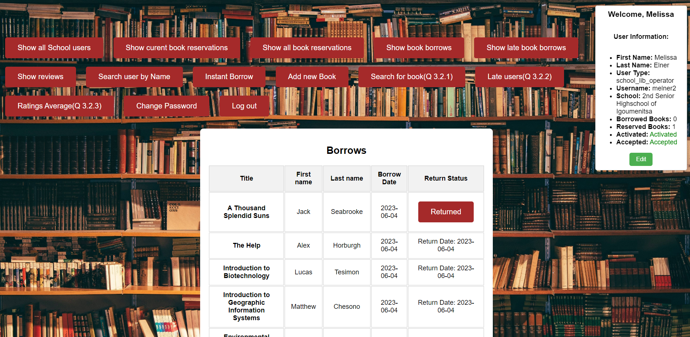

# Database-project-Library-database-2023
Database project simulating a school library app and connecting it with a database

## Authors
- Elias Kallioras  03120050
- Nikolas Xiros    03120107 

## ER Diagram

## Relational

## Usage
The school library system showcases the functionality of an interface that allows users to sign up and log in to the application. The main emphasis during development was placed on establishing a reliable connection with the database, ensuring seamless integration between the system and the database.

While the visual appearance of the interface may be simplistic, the focus was primarily on the database connection and core functionality. Users can make full use of the library and its capabilities, benefiting from the efficient interaction between the system and the database.

The aim of this project was to prioritize the functionality and database connectivity, providing a solid foundation for the school library system.

## Screenshots

